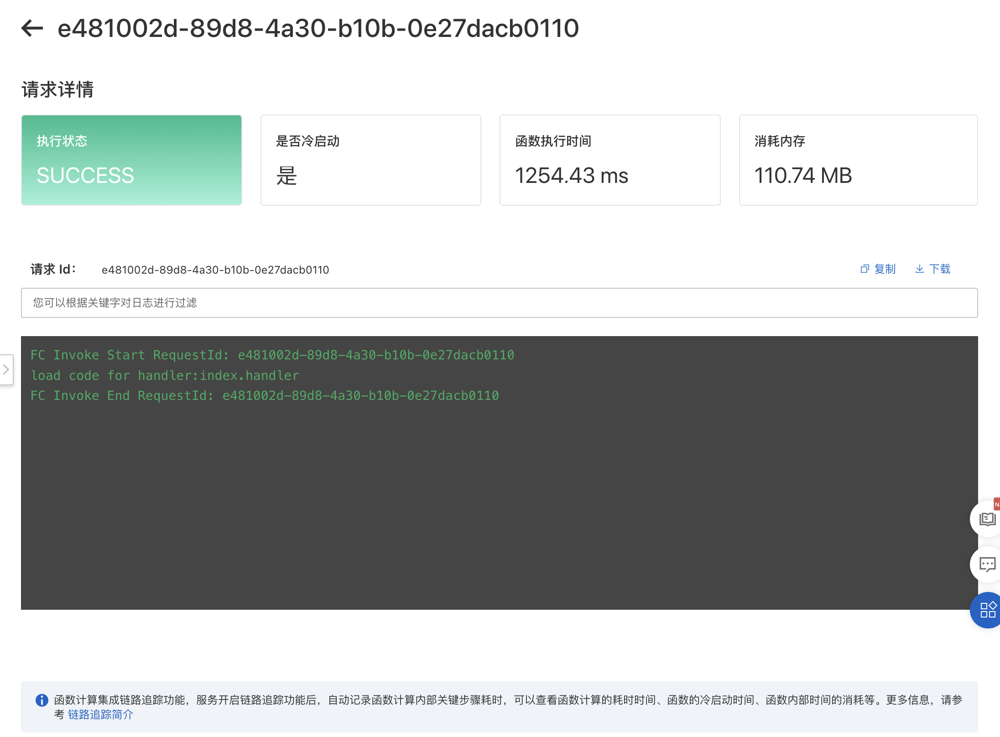

# 用户代码加载加速

PGO（Profile Guided Optimization），是一种根据运行时 Profiling Data 来进行编译优化的技术，这里我们借鉴了这一概念。主要是通过执行一遍之后收集启动阶段的热点数据生成缓存文件，后续通过加载高效的缓存文件启动即可获得提升在 100% 到 200% 的用户代码冷启动优化效果。

## 核心原理

### Require 关系 Cache

在 Node.js 的用户代码加载中，我们发现大量磁盘 IO 都是用来查找 node_modules，耗去了大量的启动时间。

在一个文件中进行 `require` 一个 `a`，它会通过一系列寻径，最终得到对应的 `a` 对应文件的绝对路径；而同样在另一个文件中也进行 `require` 一个 `a`，其得到的绝对路径可能就不相同了。PGO 将不同文件里面 `require` 各种字符串得到的结果关系一一对应起来，得到一份二维 map。有了这一份关系数据，对 `require` 函数进行改造，在寻径逻辑前加一段逻辑，即从 Map 中查找对应关系，若找到了对应关系，则直接返回对应内容；若找不到，则使用原始的寻径逻辑进行兜底，从而实现加速。

### ByteCode Cache

在反复 `require` 的逻辑中，反复判断文件是否存在是一个扎堆的逻辑，而另一个扎堆的问题就是反复读取碎片文件。

PGO 的 `Require Cache` 中除了之前提到的关系之外，还会存储：

1. 源文件的文本信息；
2. 源文件编译出来的 V8 byte code。

这些信息与关系信息一并结构化存储于一个缓存文件中，使得我们一加载这个缓存文件，无须经过任何反序列化的步骤，就可以直接使用该 Map。

有了这么一个文件，我们只需要在进程刚启动的时候加载一遍缓存文件。然后每次 require 的时候，都直接从缓存关系中查找出来对应的文件，再从缓存中获取该文件的源代码文本及其 byte code，直接加载。

这么依赖，我们省去的就是：

+ 寻径时间（反复 statx，在 Node.js 中的封装逻辑更为复杂）；
+ 读取文件时间（反复 openat，经 Node.js 封装逻辑更为复杂）；
+ 源代码文本编译执行缩减为 byte code 编译执行。


## API 使用介绍

该技术使用分为两个部分录制文件，和加载缓存文件。

**录制缓存文件：**

在全部模块加载完毕后使用如下语句进行录制，这样您的工作目录下就会出现 `require_cache.strrc` 缓存文件。

```javascript
const rrc = require('alinode/relational_require_cache');
const pgoEntries = [ process.cwd(), path.join(__dirname, 'node_modules') ];
rrc.record(pgoEntries);
```

**加载缓存文件：**

在 Node.js 执行的一开始就执行下面的语句即可使缓存生效。

```javascript
const rrc = require('alinode/relational_require_cache');
const pgoFilePath = path.join(__dirname, 'require_cache.strrc');
const pgoEntries = [ process.cwd(), path.join(__dirname, 'node_modules') ];
if (fs.existsSync(pgoFilePath)) {
  rrc.load(pgoFilePath, pgoEntries);
}
```

规模化集成使用，可以参考 Serverless Devs 的 [PGO 组件](https://github.com/midwayjs/pgo)的实现方式。

## 在阿里云函数计算中体验

目前 Noslate 发行版本已经在阿里云函数计算自 Node.js 14 起版本全量提供，只要使用 Node.js 14 版本即可使用。

目前与 [Serverless Devs](https://www.serverless-devs.com/zh-cn) 实现了集成，可以通过 Serverless Devs 的 `s cli` 直接使用。

1. 在 `s.yaml` 中的 service actions 中添加 `pre-deploy` ，配置 run 命令为 `s cli pgo`，如图所示


2. 将 `s.yaml` 中的 runtime 改为 `nodejs14`

3. 部署函数
```shell
s deploy
```

4. 调用函数
```shell
s cli fc-api invokeFunction --serviceName fctest --functionName functest1 --event '{}'
```

### 参数

可以通过 `s cli pgo gen --参数key 参数value` 来传递参数

+ `remove-nm`：构建完成 pgo 后自动删除 node_modules， `s cli pgo gen --remove-nm`

### 生成详细过程
#### 1. 基于当前项目代码，生成PGO文件

#### 2. 将生成的 PGO 文件存入项目目录

#### 3. 线上使用 PGO 文件加速启动


## 优化效果

我们以一个简单的测试程序来验证实际效果，下面是示例。

```javascript
require('eslint');
require('lodash');
require('midway');
require('webpack');
require('jsdom');
require('mysql2');
require('sequelize');

exports.handler = (event, context, callback) => {
  callback(null, {
    versions: process.versions
  });
}
```

可以看到，未使用 PGO 并且在仅安装 Production 依赖的情况下，冷启动时请求执行时间达到 3069.39 ms。


### PGO 优化冷启动

向现有的函数代码包增加 PGO 缓存文件，下图可以看到采用 PGO 缓存进行冷启动，时间降到了 1254.43 ms。约等于减少了 61% 的冷启动时间，提升 150% 左右。



### 仅使用 PGO 缓存启动

在大多数情况下，如果您的业务代码可控，所有模块依赖都已经在初始化阶段引入，也可以尝试只保留 PGO 缓存文件来启动（即删除 node_modules）。因为减少了至少一半的代码包大小以及减少了碎文件数量，这样会极大的降低代码包下载和代码包解压的时间，在类似真实情况的压测场景有所体现，下图 P50 到 P99 百分数指标都有较大比重的下降。

现有代码包附加 PGO 缓存：


只使用 PGO 缓存启动（删除 node_modules）：


