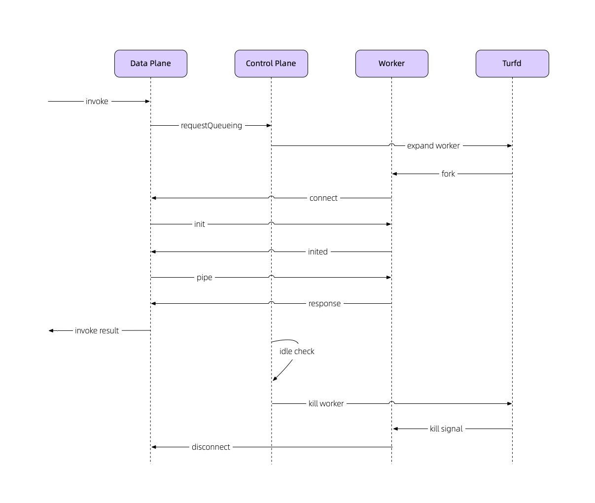
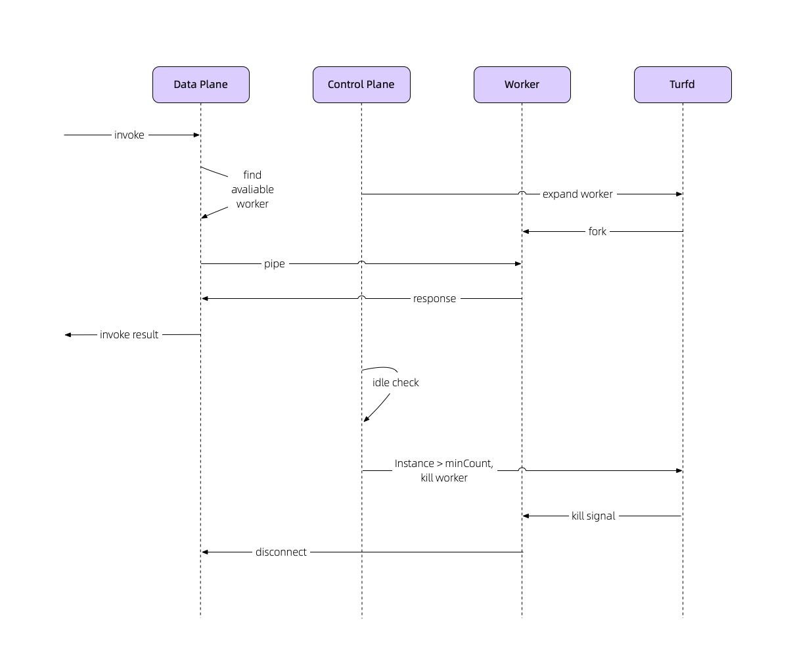
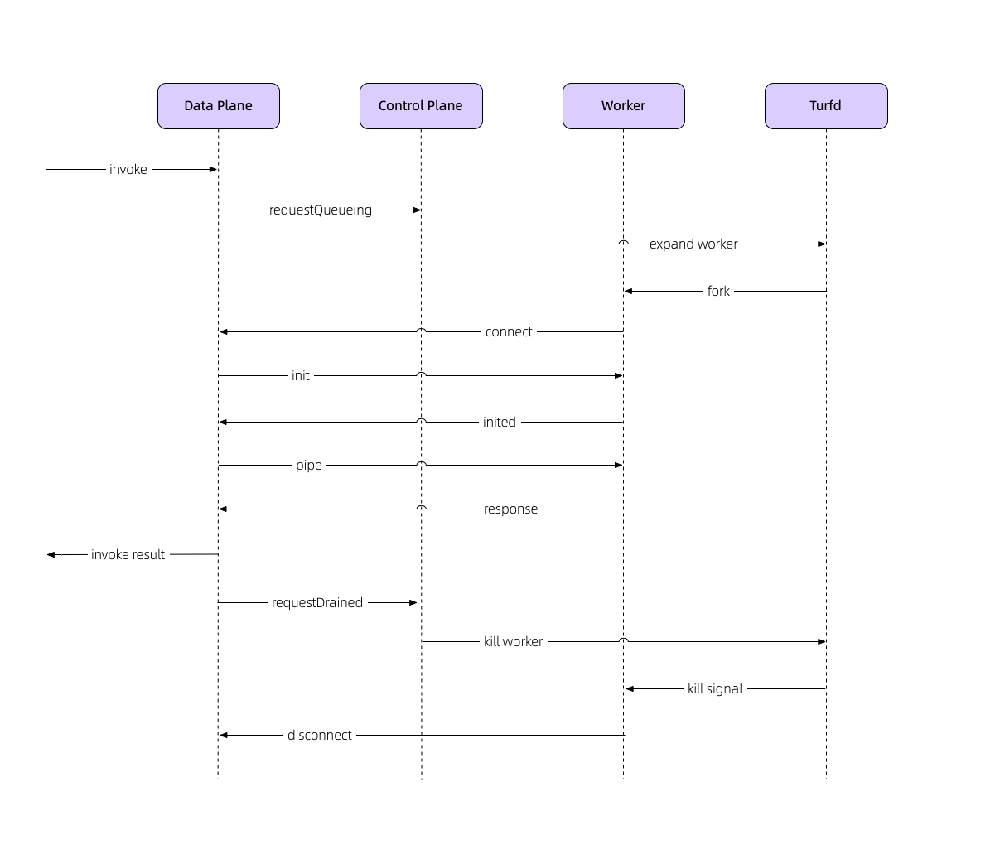

# 弹性策略

Noslated 整体的设计理念是 Worker 实例基于流量拉起，快弹慢缩。

## 一、基础策略
当流量进入 Data Plane 后，如果没有能够处理请求的 Worker 实例，会通过 **requestQueueing** 事件通知 Control Plane，它会根据当前水位决定扩容数量，如果当前已无法创建 Worker 实例，会返回资源上限报错。新的 Worker 实例启动后，会自动连接到 Data Plane，Data Plane 发现新的 Worker 实例连接后会主动触发初始化请求，初始化成功后开始消费请求队列里堆积的请求。

当 Worker 实例闲置一段时间后，Control Plane 会主动发起 GC 操作，告知 Data Plane 关闭流量，流量关闭后，Control Plane 会通知 Turf 关闭 Worker 实例，清理资源残留。



## 二、预留策略
有的 Worker 实例启动时间会比较长，为了能够及时的响应请求，提供了 Worker 实例最小实例数配置，即预留配置。流量到来时会直接筛选可用 Worker 实例并分发流量，如果流量水位过高，会按照（一）中策略执行扩容操作，并在空闲时缩容，但是缩容结果不会小于最小实例数配置的值。

```
// Worker 实例配置
{
    "worker": {
        "reservationCount": 1
    }
}
```



## 三、即抛模式
针对特殊场景，如用户脚本执行，为了隔离不同请求间的上下文，可以针对每个请求创建一个 Worker 实例，并在执行后销毁。

```
// Worker 实例配置
{
    "worker": {
        "disposable": true
    }
}
```



Node.js Worker 实例一般启动时间较长，可以使用 Aworker 运行时并配合 [Warmfork](../aworker//intro.md#warmfork) 以及 [Startup Snapshot](../aworker//intro.md#startup-snapshot) 能力，更快完成 Worker 实例启动。

## 四、缩容策略
默认的缩容策略是选择当前最小并发度的 Worker 实例，即最空闲的 Worker 实例。但是还支持其他两种策略，FIFO（先创建先销毁）和FILO（先创建后销毁），可以在 Worker 实例配置中设置。
```
type ShrinkStrategy = 'FILO' | 'FIFO' | 'LCC';
// Worker 实例配置
{
    "worker": {
        "shrinkStrategy": "LCC"
    }
}
```
