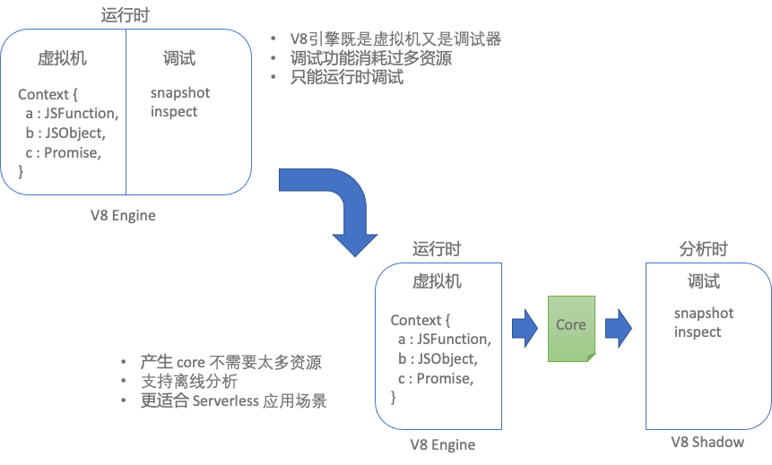

# Noslate Debugger Introduction

<div style={{maxWidth: "800px"}} >


</div>

## What is Noslate Debugger

Noslate Debugger is an offline analysis tool for V8 applications. It can analyze the Corefile (Core file) generated by applications such as Node.js.

* Inspect Node.js/V8 application's structure, stack, etc.
* Check various object information in the V8 heap
* Export Heap Snapshot from Corefile
* Get Corefile without business sense (through Arthur tool)
* Supported Node.js / Alinode / AWorker LTS official release

### Easy to use

Analyze Corefiles on MacOS/Linux/Windows (via WSL) with just one command.
```
andb -l -c core.123
```
> `andb` is an offline analysis tool in the Noslate Deubber suite, based on the secondary development of the `gdb`/`lldb` plugin system.

`andb` will automatically download the version of Node.js that matches the Core generation and start debugging. You can choose the `gdb` or `lldb` tool you are familiar with to start debugging.

<video controls>
      <source src="/demo_andb.mp4" />
</video>


* Demonstrate loading Corefile and automatically matching version and debugging information
* Demonstrate positioning and printing of the Isolate structure
* Demo V8 Heap Space and Page information
* Demonstrate V8 Heap Summary and Inspect objects
* Demo Heap Snapshot export


## Adapt to Serverless

For a long time, Node.js application development has been using Inspector to debug code or heap snapshot (Heap Snapshot) to locate OOM problems. These locally developed tools and features support the development of huge applications.

Serverless applications usually use a large number of containers with short life cycles and small sizes, but it is not easy to obtain debugging and diagnostic capabilities on such containers, which makes serverless applications in a relatively black box situation for a long time.
* Inspector requires a stable and live internet connection
* Heap Snapshot requires more computing and memory resources

### Corefile based "snapshot"

Whether it is a V8 object or a heap snapshot, it is the storage of "information" in memory, and the Inspector function can extract this information at "runtime".
Noslate Debugger transfers this part of debugging and diagnosis capabilities to offline through Corefile, so that the original online diagnosis and debugging with high real-time requirements can be transformed into integrated use with simple file upload.

Provides a sense of debugging and diagnosis that is close to the user's local development on the user's local or cloud service.

<div style={{maxWidth: "700px"}} >



</div>

> Corefile (specifically the GNU Corefile format) mainly records the memory and register dumps of the Node.js process (CoreDump: the process of memory to disk).
> So it is also the complete "information" of the process, which is used as a debug carrier for Linux system applications `Crash (lossy)`, and can also be used for `GCore (lossless)` to generate process snapshots for offline analysis.
> If OOM occurs in Node.js, the `core.<pid>` file is generally generated. Because the memory copy is large, it takes up a lot of disk space, and frequent crashes will cause the disk space to be exhausted.


### Smaller business impact

Compared with the original online "heap snapshot", the impact on the business is as long as several minutes, and only affects the business in RT seconds (through `GCore`), or even only tens of milliseconds (through `Arthur`).

The `Corefile` snapshot also does not have any runtime "add oil and vinegar", so it is also suitable for those objects that have not been GCed, such as diagnosing business processing that has ended.

> `Arthur` is a tool developed by Noslate Debugger for low-impact acquisition of `core files`, using fork to reduce process pause time, and LZ4 compression to reduce dump volume.
> Extract memory snapshots by fork child processes without affecting the continued operation of the target business process, further reducing the impact of business process RT to millisecond level.
> Usually a `Core file` can be compressed to about 20% of the original size, depending on whether the information is compressible, the compression rate of text is larger.

Online environment capture with business traffic, the business impact is 31.106 milliseconds, and the Corefile size is 338 MB (the process originally used 1.44 GB of physical memory)
```bash
$arthur -p 13481
arthur[14380] I: thread: 13482
arthur[14380] I: thread: 13483
arthur[14380] I: thread: 13484
arthur[14380] I: thread: 13485
arthur[14380] I: thread: 13486
arthur[14380] I: thread: 13487
arthur[14380] I: thread: 13497
arthur[14380] I: thread: 13498
arthur[14380] I: thread: 13499
arthur[14380] I: thread: 13500
arthur[14380] I: remote mmap at 0x7f1e596a33a0
arthur[14380] I: remote fork at 0x7f1e5966fed0
arthur[14380] I: mmap = 0x7f1e5a7ce000
arthur[14380] I: child_pid = 14381
arthur[14380] I: munmap = 0
arthur[14380] W: pread mem(0x7ffe597aa000) failed(5).
arthur[14380] W: pread mem(0xffffffffff600000) failed(22).
arthur[14380] I: waitpid = 14381
arthur[14380] I: Process 13481 paused 31.106 ms.
arthur[14380] I: Compressed 1437173002 bytes into 337922551 bytes ==> 23.51%
```


## Debug info repository

For traditional C++ programs, only the binary compiled into the Debug version can debug the ability to view structure information, etc. The reason is that the compiler adds DebugInfo (debug information) when compiling.
Debug is very large, and `node_g` is often more than 1GB, so the official release usually adopts the Release release.
Noslate Debugger builds a LTS version of the debug information library for Node.js / Alinode / Aworker,
The extra debugging information is encapsulated in the `node.typ` file and combined and compressed, so that the file size is about 10MB,
Also includes those historical versions that have been released.

`andb` also provides multi-version offline debugging capabilities based on the debugging information library.