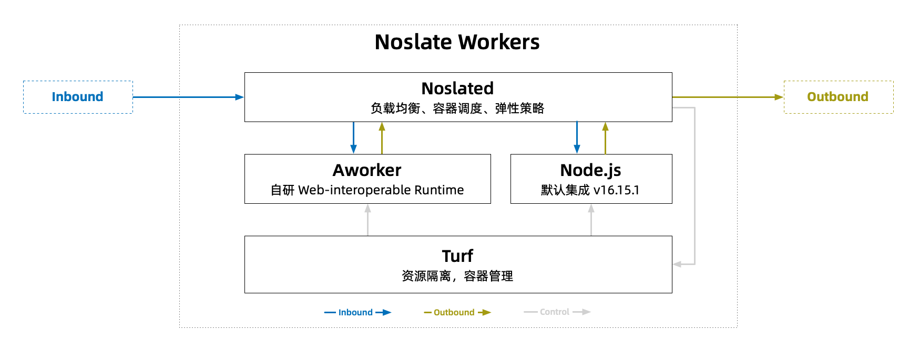

# 

Noslate Workers - Lightweight JavaScript Serverless Solution

Relying on the Web-interoperable runtime Aworker, it provides a lightweight, nearly 0 cost cold-start JavaScript Serverless runtime environment. Through it, lightweight serverless capabilities can be easily integrated into the existing architecture.

Unlike traditional FaaS architectures, this is a lightweight task unit on top of common application containers. Benefited from the excellent dynamic task high-density mixing and isolation features, and the near-zero cold-start feature based on the Task State Replication API, tasks can be started and stopped immediately, and no need to care about the orchestration of task nodes in the entire cluster.

### Aworker
Web-interoperable JavaScript runtime providing Web API standards. Through the Startup Snapshot and WarmFork capabilities, faster horizontal and vertical expansion is achieved, and traffic can be started and processed in milliseconds, with higher elastic efficiency.

[Learn more about Aworker](./aworker/intro)

### Noslated
Noslate Workers Container Deamon, provides the capabilities of Worker instance scheduling, elastic expansion, configuration management, and traffic management required by Serverless.

[Learn more about Noslated](./noslated/intro)

### Turf
Under the Noslate Workers architecture, the scheduling unit sinks from the previous container to the process, so resource isolation is very important. Based on the capabilities provided by the Linux system, we achieve minimal authorization and resource usage restrictions for execution units, and the user interface design complies with the OCI specification to provide Worker instance management capabilities. As a basic component, it is responsible for managing the life cycle and resource usage of each Worker instance execution unit.

[Learn more about Turf](./turf/intro)

